# Домашнее задание к занятию 2. «Применение принципов IaaC в работе с виртуальными машинами» - Илларионов Дмитрий

#### Это задание для самостоятельной отработки навыков и не предполагает обратной связи от преподавателя. Его выполнение не влияет на завершение модуля. Но мы рекомендуем его выполнить, чтобы закрепить полученные знания. Все вопросы, возникающие в процессе выполнения заданий, пишите в учебный чат или в раздел "Вопросы по заданиям" в личном кабинете.
---
## Важно

**Перед началом работы над заданием изучите [Инструкцию по экономии облачных ресурсов](https://github.com/netology-code/devops-materials/blob/master/cloudwork.MD).**
Перед отправкой работы на проверку удаляйте неиспользуемые ресурсы.
Это нужно, чтобы не расходовать средства, полученные в результате использования промокода.
Подробные рекомендации [здесь](https://github.com/netology-code/virt-homeworks/blob/virt-11/r/README.md).

---

### Цели задания

1. Научиться создвать виртуальные машины в Virtualbox с помощью Vagrant.
2. Научиться базовому использованию packer в yandex cloud.

   
## Задача 1
Установите на личный Linux-компьютер или учебную **локальную** ВМ с Linux следующие сервисы(желательно ОС ubuntu 20.04):

- [VirtualBox](https://www.virtualbox.org/),
- [Vagrant](https://github.com/netology-code/devops-materials), рекомендуем версию 2.3.4
- [Packer](https://github.com/netology-code/devops-materials/blob/master/README.md) версии 1.9.х + плагин от Яндекс Облако по [инструкции](https://cloud.yandex.ru/docs/tutorials/infrastructure-management/packer-quickstart)
- [уandex cloud cli](https://cloud.yandex.com/ru/docs/cli/quickstart) Так же инициализируйте профиль с помощью ```yc init``` .


Примечание: Облачная ВМ с Linux в данной задаче не подойдёт из-за ограничений облачного провайдера. У вас просто не установится virtualbox.

### Решение задачи 1

* Установил ubuntu 20.04

* Установил virtualbox

```
apt install virtualbox
```

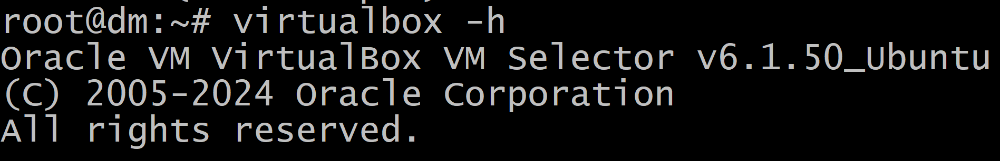

* Установка Vagrant

** нашел пакет для AMD linux тут: https://hashicorp-releases.yandexcloud.net/vagrant/2.4.1/ 
** скачал пакет 
```
wget https://hashicorp-releases.yandexcloud.net/vagrant/2.4.1/vagrant_2.4.1-1_amd64.deb
```


** устанавливаю пакет:
```
dpkg -i vagrant_2.4.1-1_amd64.deb
```
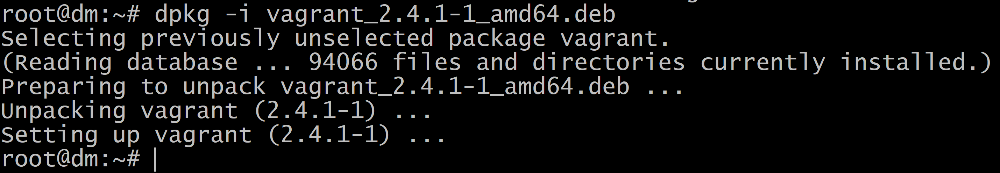

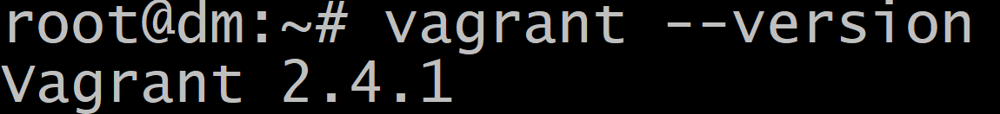

* Установка packer
** нашел пакеты тут https://hashicorp-releases.yandexcloud.net/packer/1.10.2/ 
** копирую для linux amd 64
** скачиваю файл на ВМ:

```
wget https://hashicorp-releases.yandexcloud.net/packer/1.10.2/packer_1.10.2_linux_amd64.zip
```

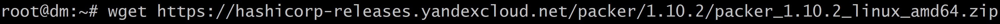

```
apt install unzip
unzip packer_1.10.2_linux_amd64.zip -d ~
cp packer /usr/bin/
```
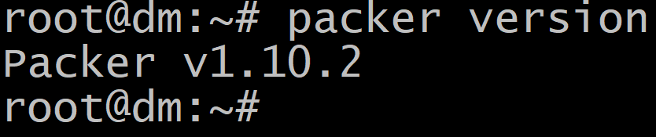

* Установка плагина яндекса

** создать конф. файл:

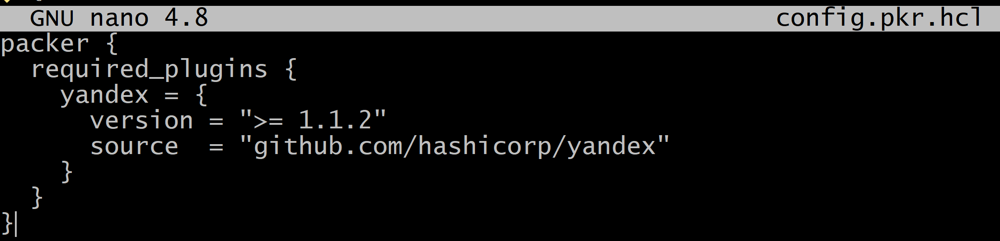

```
packer {
  required_plugins {
    yandex = {
      version = ">= 1.1.2"
      source  = "github.com/hashicorp/yandex"
    }
  }
}
```

** инициализируем подключение к яндексу

```
packer init config.pkr.hcl
```

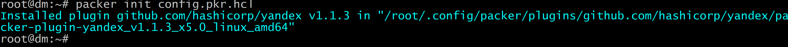

* Установка ya cli

```
curl -sSL https://storage.yandexcloud.net/yandexcloud-yc/install.sh | bash
```
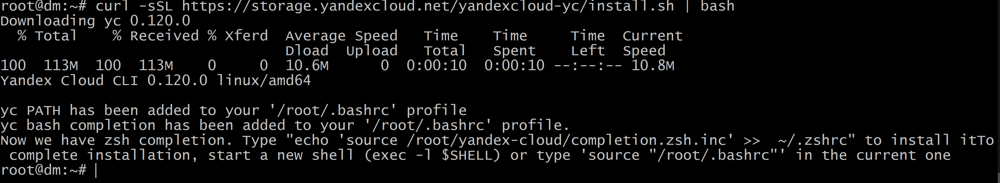

** перезагрузил оболочку - перезашел.
** oAuth токен уже есть.

** инициализация yc

```
yc init
```

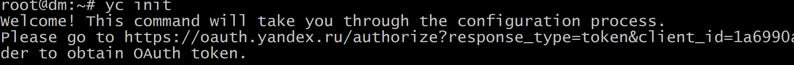


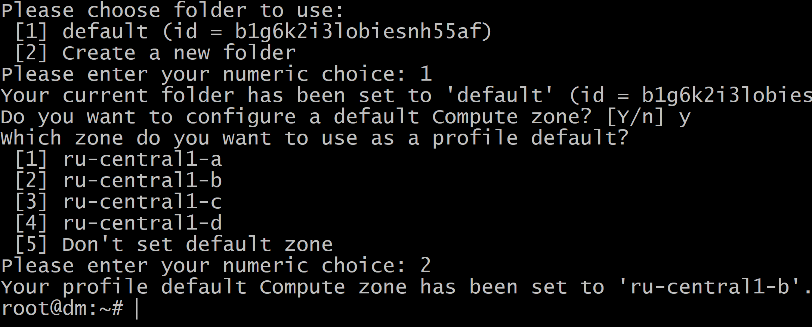

посмотреть так:
```
yc config list
```
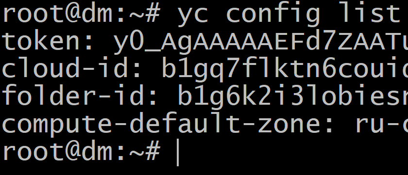

---

## Задача 2

1. Убедитесь, что у вас есть ssh ключ в ОС или создайте его с помощью команды ```ssh-keygen -t ed25519```
2. Создайте виртуальную машину Virtualbox с помощью Vagrant и  [Vagrantfile](https://github.com/netology-code/virtd-homeworks/blob/shvirtd-1/05-virt-02-iaac/src/Vagrantfile) в директории src.
3. Зайдите внутрь ВМ и убедитесь, что Docker установлен с помощью команды:
```
docker version && docker compose version
```

3. Если Vagrant выдаёт ошибку (блокировка трафика):
```
URL: ["https://vagrantcloud.com/bento/ubuntu-20.04"]     
Error: The requested URL returned error: 404:
```

Выполните следующие действия:

- Скачайте с [сайта](https://app.vagrantup.com/bento/boxes/ubuntu-20.04) файл-образ "bento/ubuntu-20.04".
- Добавьте его в список образов Vagrant: "vagrant box add bento/ubuntu-20.04 <путь к файлу>".

**Важно:**    
- Если ваша хостовая рабочая станция - это windows ОС, то у вас могут возникнуть проблемы со вложенной виртуализацией. Ознакомиться со cпособами решения можно [по ссылке](https://www.comss.ru/page.php?id=7726).

- Если вы устанавливали hyper-v или docker desktop, то  все равно может возникать ошибка:  
`Stderr: VBoxManage: error: AMD-V VT-X is not available (VERR_SVM_NO_SVM)`   
 Попробуйте в этом случае выполнить в Windows от администратора команду `bcdedit /set hypervisorlaunchtype off` и перезагрузиться.

- Если ваша рабочая станция в меру различных факторов не может запустить вложенную виртуализацию - допускается неполное выполнение(до ошибки запуска ВМ)

---

### Решение задачи 2

* скачала от сюда образ: https://app.vagrantup.com/bento/boxes/ubuntu-20.04

```
wget https://app.vagrantup.com/bento/boxes/ubuntu-20.04/versions/202401.31.0/providers/virtualbox/amd64/vagrant.box
```
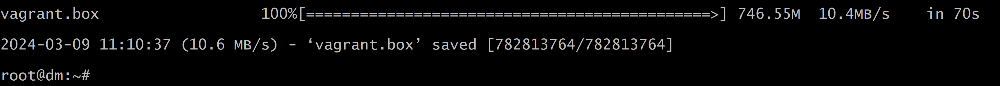


```
vagrant box add bento/ubuntu-20.04 vagrant.box
```
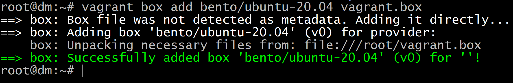

```
vagrant box list
```

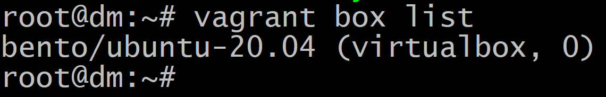

** создал файл:
```
nano Vagrantfile
```
и заполнил - его 

** пробую запустить:
```
vagrant up
```

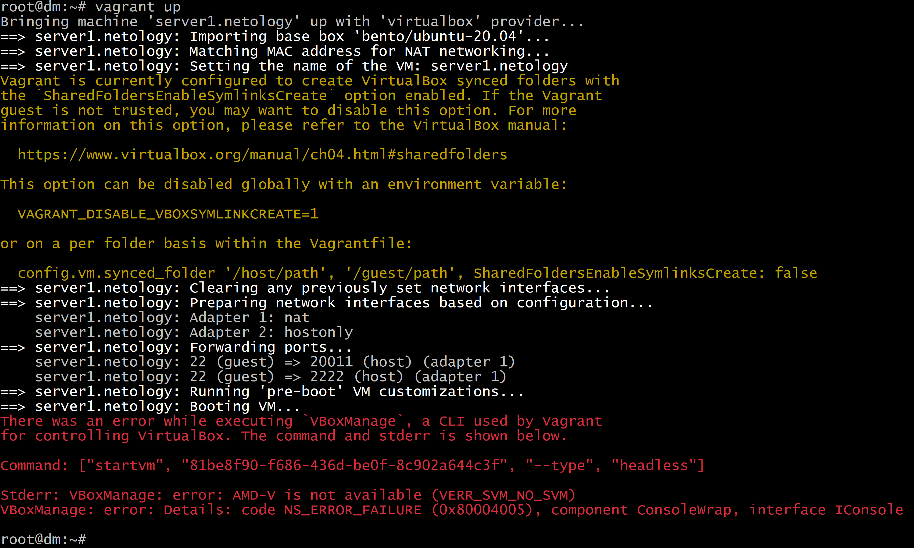

На ПК еще установлен hyper-V Поэтому в cmd пробую:

```
C:\WINDOWS\system32>bcdedit /set hypervisorlaunchtype off
```

И перезагрузился.

Но, проблема осталась:


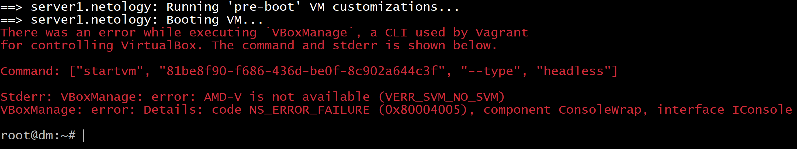

** в cmd

```
C:\WINDOWS\system32>cd C:\Program Files\Oracle\VirtualBox
C:\Program Files\Oracle\VirtualBox>VBoxManage.exe list vms
```
Сначала не выключил ВМ и поэтому ошибка:

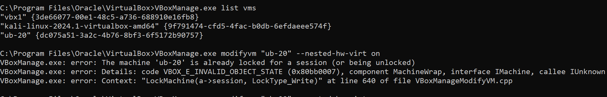

Потом выключил и повторил:
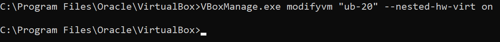

В машине включена вложенная:
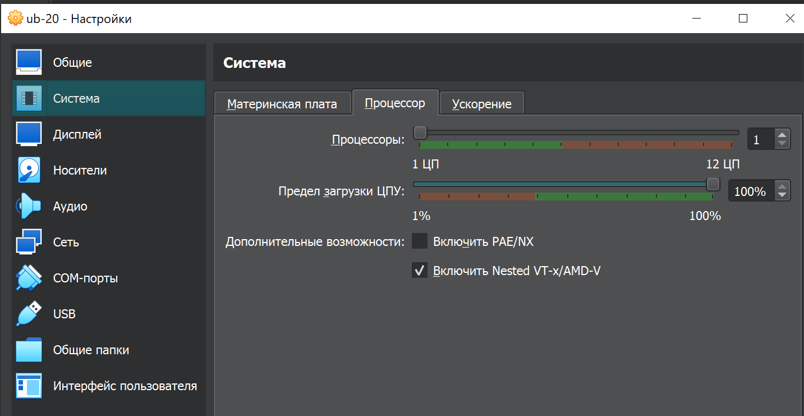

** опять попробовал, но, оказалось что еще не создал ключ SSH поэтому не удается подключиться:

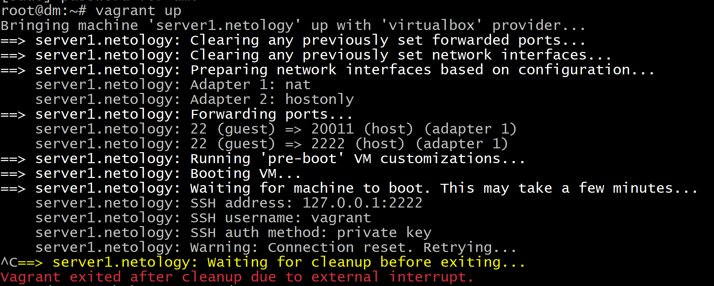
Сбросил подключение.

Создал ключ:

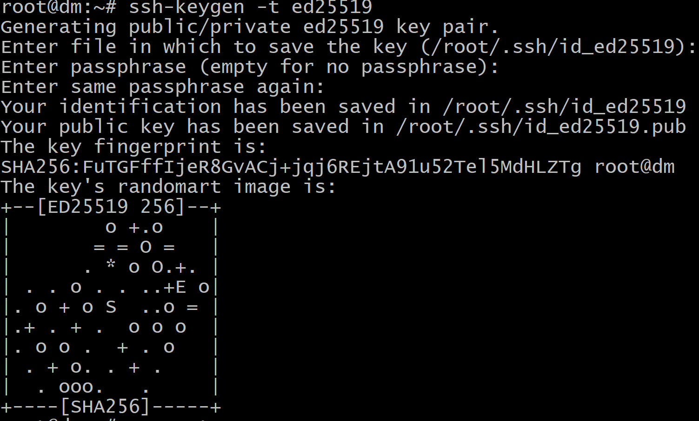

После этого подключение пошло:
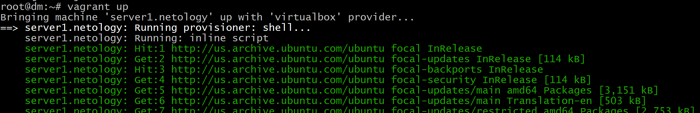

Но, что получилось пока не понятно:

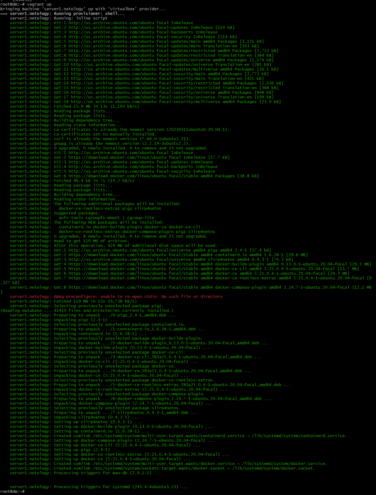

Еще раз попробовал:

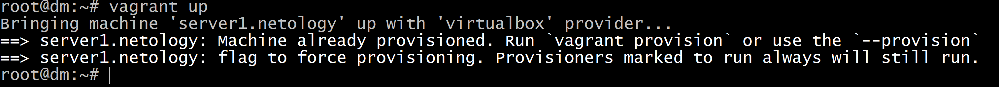

** удалось подключиться к ВМ:

```
vagrant ssh
```

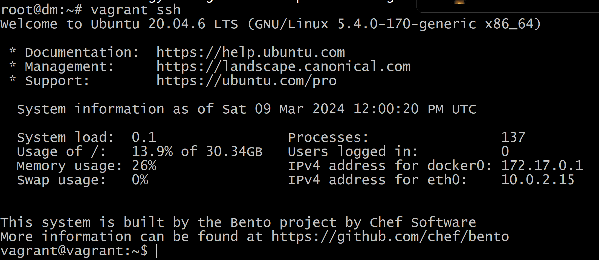


```
cat /etc/*release
```

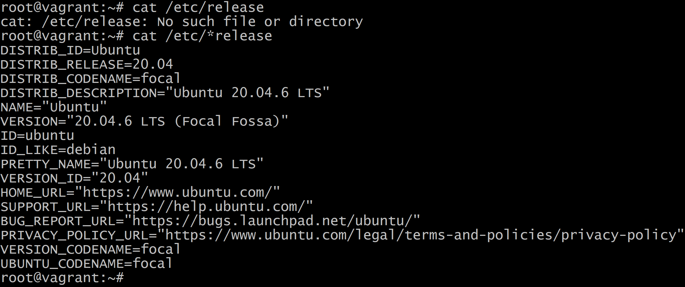

---

## Задача 3 решение задачи 3

1. Отредактируйте файл    или  [mydebian.json.pkr.hcl](https://github.com/netology-code/virtd-homeworks/blob/shvirtd-1/05-virt-02-iaac/src/mydebian.json.pkr.hcl)  в директории src (packer умеет и в json, и в hcl форматы):
   - добавьте в скрипт установку docker (возьмите готовый bash-скрипт из [Vagrantfile](https://github.com/netology-code/virtd-homeworks/blob/shvirtd-1/05-virt-02-iaac/src/Vagrantfile)  или  [документации]( https://docs.docker.com/engine/install/ubuntu/#install-using-the-repository)  к docker), 
   - дополнительно установите в данном образе htop и tmux.(не забудьте про ключ автоматического подтверждения установки для apt)
3. Найдите свой образ в web консоли yandex_cloud
4. Необязательное задание(*): найдите в документации yandex cloud как найти свой образ с помощью утилиты командной строки "yc cli".
5. Создайте новую ВМ (минимальные параметры) в облаке, используя данный образ.
6. Подключитесь по ssh и убедитесь в наличии установленного docker.
7. Удалите ВМ и образ.
8. **ВНИМАНИЕ!** Никогда не выкладываете oauth token от облака в git-репозиторий! Утечка секретного токена может привести к финансовым потерям. После выполнения задания обязательно удалите секретные данные из файла mydebian.json и mydebian.json.pkr.hcl. (замените содержимое токена на  "ххххх")
9. В качестве ответа на задание  загрузите результирующий файл в ваш ЛК.


### Решение

* Сейчас пока в облаке нет своих имаджей:
```
yc compute image list
```
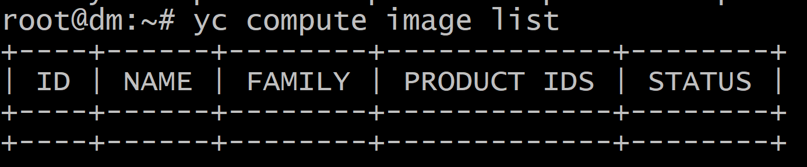


* Создам сеть и подсеть:

```
yc vpc network create --name net --labels my-label=my-net --description "My network"
```
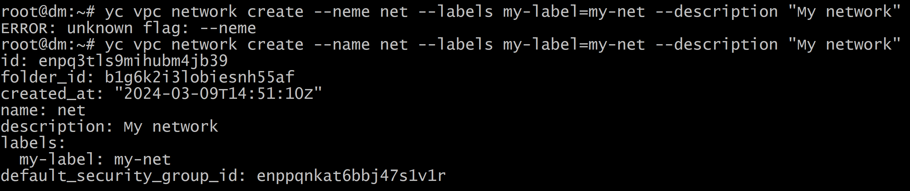

Создаем подсеть:

```
yc vpc subnet create --name my-subnet-b --zone ru-central1-b --range 10.1.2.0/24 --network-name net --description "My subnet"
```
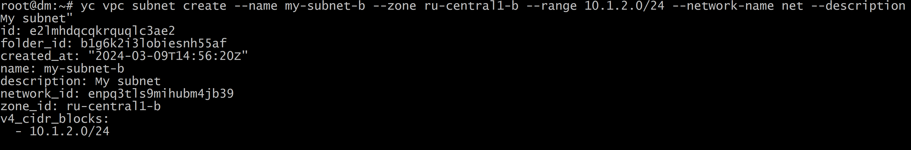

ID сети:
e2lmhdqcqkrquqlc3ae2

Создадим свой имадж с докером.

1. Отредактировал mydebian.json.pkr.hcl добавил код установки docker для создания образа через packer, и указал данны еоблака:

```
source "yandex" "debian_docker" {
  disk_type           = "network-hdd"
  folder_id           = "${file("./folderid")}"
  image_description   = "my custom debian with docker"
  image_name          = "debian-11-docker"
  source_image_family = "debian-11"
  ssh_username        = "debian"
  subnet_id           = "e2lmhdqcqkrquqlc3ae2"
  token               = "${file("./yctoken")}"
  use_ipv4_nat        = true
  zone                = "ru-central1-b"
}

build {
  sources = ["source.yandex.debian_docker"]

  provisioner "shell" {
    inline = ["echo 'hello from packer'",
              "export DEBIAN_FRONTEND=noninteractive",
              "sudo apt-get update",
              "sudo apt-get install -y ca-certificates curl gnupg",
              "sudo install -m 0755 -d /etc/apt/keyrings",
              "curl -fsSL https://download.docker.com/linux/ubuntu/gpg | sudo gpg --dearmor -o /etc/apt/keyrings/docker.gpg",
              "sudo chmod a+r /etc/apt/keyrings/docker.gpg",
              "echo \"deb [arch=$(dpkg --print-architecture) signed-by=/etc/apt/keyrings/docker.gpg] https://download.docker.>
              "sudo apt-get update",
              "sudo apt-get install -y docker-ce docker-ce-cli containerd.io docker-buildx-plugin docker-compose-plugin"
    ]
  }

}
```
Проверил валидность:

```
packer validate mydebian.json.pkr.hcl
```
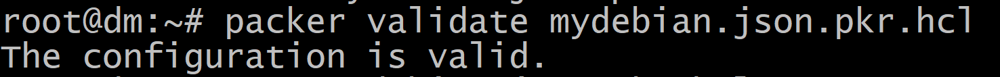

Но, при сборке оказалось что это не работает:
```
  folder_id           = "${file("./folderid")}"
  token               = "${file("./yctoken")}"
```

Поэтому просто заменил на код сразу - заработало:

После этого уже что-то заработало, но, сошибками:
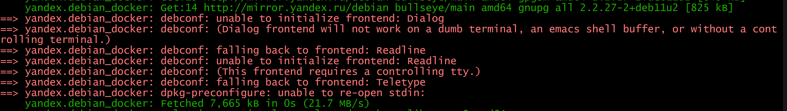


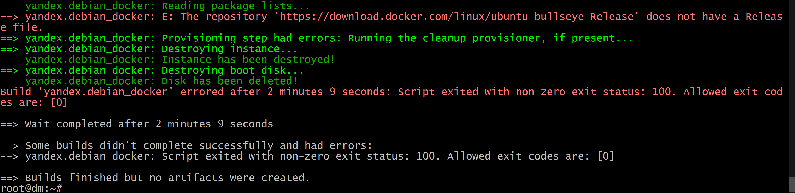

Попробовал убрал код установки докера и прошло без ошибок:

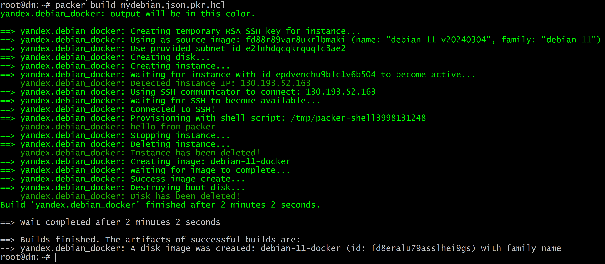

Попробовал заменить код установки докера - для дебиана:

```
  provisioner "shell" {
    inline = ["echo 'hello from packer'",
              "sudo apt-get update",
              "sudo apt-get install ca-certificates curl",
              "sudo install -m 0755 -d /etc/apt/keyrings",
              "sudo curl -fsSL https://download.docker.com/linux/debian/gpg -o /etc/apt/keyrings/docker.asc",
              "sudo chmod a+r /etc/apt/keyrings/docker.asc",
              "echo \
                \"deb [arch=$(dpkg --print-architecture) signed-by=/etc/apt/keyrings/docker.asc] https://download.docker.com/linux/debian \
                $(. /etc/os-release && echo \"$VERSION_CODENAME\") stable\" | \
                sudo tee /etc/apt/sources.list.d/docker.list > /dev/null",
              "sudo apt-get update",
              "sudo apt-get install docker-ce docker-ce-cli containerd.io docker-buildx-plugin docker-compose-plugin"
    ]
  }
```

Но, не особо помогло, все равно ошибка.

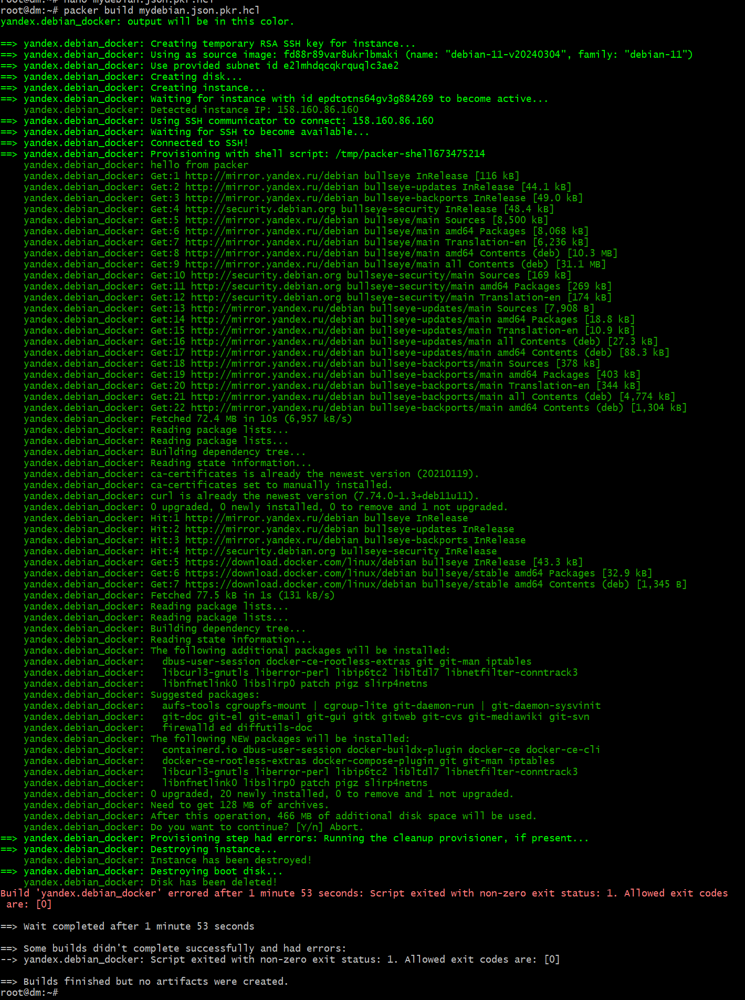

Больше нет времени разбираться, оставляю так.